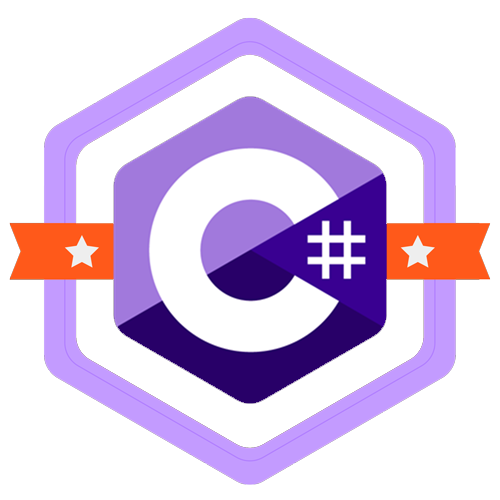

## Olá, sou Rick, bem vindo ao meu Git! =D

### Sobre mim
Estudante de ADS
Apaixonado por desenvolvimento de software! ❤️

* Estou sempre estudando e procurando evoluir mais a cada dia ⏳

      

  

