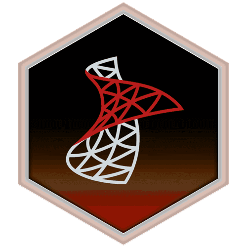

<a href="mailto:gavirate.henrique@gmail.com">

## Hello there
I don't really know how u got here, but I will try to show a little bit about myself for you.

## A little about myself
My name is Luis Henrique. I'from in Guariba-SP, Brazil. 
My job is to develop new bridges between conversational intelligence and financial proposals in a simple way.

## More details

* Age: 27  
* University:  
 Software Analysis and Development - Uniasselvi 2020 - 2023  
 Data Science - Univesp - 2021 - 2024   
* SKILLS:  
 
 -
 -
 -
 -
 -
 -
 - 
 -
 -

  
   

